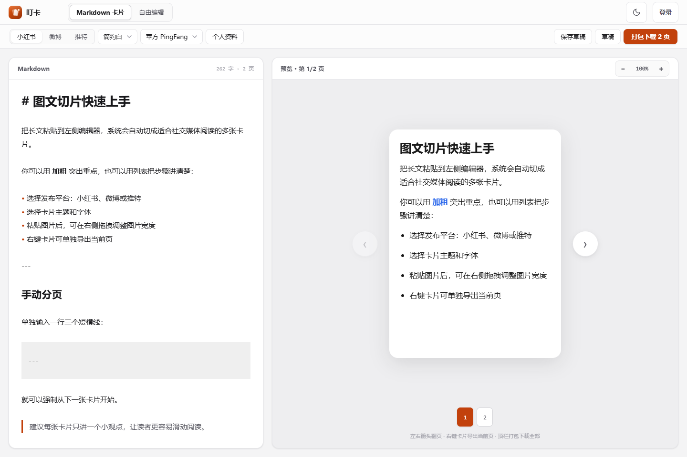
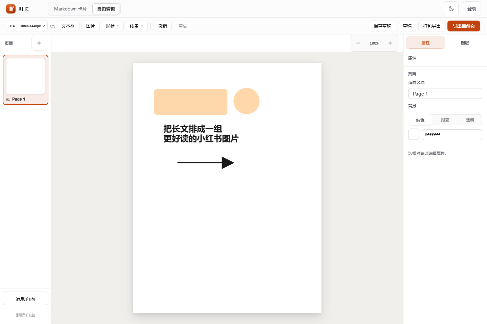
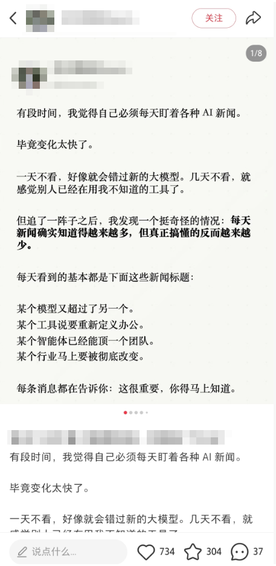

<div align="center">
  <h1> 叮卡</h1>
  <p><strong>小红书长文排版 + 轻设计出图</strong></p>
  <p>把一篇长文整理成适合滑动阅读的图文卡片，也能在自由画布里完成封面和重点页。</p>
  <p>
    <a href="CHANGELOG.md"></a>
    <a href="https://github.com/lottshin/DingCard/actions/workflows/ci.yml"></a>
    <a href="https://dingcard.vercel.app"></a>
    <a href="docs/deployment.md"></a>
  </p>
  <p>
    <a href="https://vercel.com/new/clone?repository-url=https%3A%2F%2Fgithub.com%2Flottshin%2FDingCard">
      
    </a>
  </p>
  <p><sub>在线版和 Vercel 一键部署使用浏览器本地存储，请及时导出重要作品。</sub></p>
</div>

<p align="center">
  
  
</p>

<p align="center"><sub>左：推特长文自动分页　右：自由画布编辑封面</sub></p>

## 为什么做叮卡

小红书已经提供长文模板，也有不少长文取得了不错的阅读和互动数据。不过，现有模板可调整的内容比较有限，分页方式和字体样式不容易随文章内容调整，图文布局也很难进一步细化。叮卡最初就是为了解决这个问题，让长文排版和配图设计有更多调整空间。

<p align="center">
  
  
</p>

<p align="center"><sub>小红书长文内容示例，账号信息已做模糊处理</sub></p>

叮卡把内容排版和轻量设计放在同一个浏览器工具中：

- 写长文时，用 Markdown 专注内容，实时预览分页效果。
- 做封面或重点页时，切到自由画布，在页面上安排内容并管理图层。
- 完成后导出当前页，或把整组图片打包为 ZIP。
- 默认数据保存在本地浏览器；需要跨设备同步时，可以连接仓库自带的 Fastify + SQLite 服务。

## 两种创作方式

### Markdown 长文排版

把 Markdown 粘到左侧，右侧会同步生成分页预览，适合整理教程、清单和知识分享。

- 发布时可以在小红书、微博和推特的预设尺寸之间切换。
- 选定主题后，仍然可以调整字体、圆角以及个人资料的显示方式。
- 正文中的 `---` 会被当作分页标记，方便你在需要的位置开始下一张卡片。
- 图片粘贴后可以在预览区域调整宽度，不必重新处理原图。
- 当前页面可以单独导出，全部分页也可以一次打包下载。


### 自由画布轻设计

需要自己安排版面时，可以切到自由画布，在同一个作品里完成封面和多页内容。

- 画布里可以加入文字、图片和基础图形，并直接拖动它们的位置和大小。
- 图层面板可以修改名称和顺序；相关对象也可以编成一组。
- 暂时不需要的对象可以隐藏，正在调整的对象可以锁定，避免误操作。
- 多页作品可以分别设置尺寸，页面之间也可以复制和调整。
- 导出时可以选择当前页面，也可以把全部页面打包成 ZIP。


## 使用与部署

只想看看效果，可以直接打开[在线 Demo](https://dingcard.vercel.app)。想要一份自己的在线地址，点击上方的 Vercel 按钮即可。Vercel 部署不需要环境变量，草稿仍然保存在访问者当前使用的浏览器中。

需要真实账号、跨设备草稿和服务端图片时，再部署完整应用。下面的流程适用于已经安装 Git、Docker Engine、Docker Compose 和 OpenSSL 的 Linux 服务器。`.env.example` 固定使用 `DINGCARD_VERSION=0.11.0`：

```bash
git clone https://github.com/lottshin/DingCard.git
cd DingCard

cp .env.example .env
JWT_SECRET="$(openssl rand -hex 32)"
sed -i "s/^JWT_SECRET=.*/JWT_SECRET=${JWT_SECRET}/" .env
unset JWT_SECRET

docker compose config --quiet
docker compose pull
docker compose up -d --no-build
docker compose ps
curl -f http://127.0.0.1:8080/api/health
```

健康检查返回 `{"ok":true}` 后，通过 `http://服务器地址:8080` 打开叮卡。这个 HTTP 入口只适合首次验证；正式使用前，请按[部署指南](docs/deployment.md)配置域名、HTTPS 和备份，并把 8080 端口限制在服务器本机。需要从当前源码构建镜像时，单独运行 `docker compose up -d --build app`。Windows 和 macOS 可以用 Docker Desktop 试跑同一套 Compose，但不建议作为生产服务器。

## 本地开发

本地开发需要 Git、Node.js 20+ 和 npm，不需要后端：

```bash
git clone https://github.com/lottshin/DingCard.git
cd DingCard
npm ci
npm run dev
```

打开终端输出的地址即可使用。构建并预览生产版本：

```bash
npm run build
npm run preview
```

运行 Playwright E2E 时还需要 Chrome；全栈联调和 Docker 部署才需要 Docker Compose。

## 数据模式

### 本地模式

本地模式是默认配置。账号和草稿保存在 `localStorage`，图片由 `sessionStorage` 和草稿副本管理。

- 不需要服务器，克隆后即可运行。
- 数据只存在当前浏览器，清理浏览器数据会删除本地内容。
- 本地账号仅用于浏览器内区分草稿，不是真实远程身份认证，请勿复用重要密码。
- 重要作品应及时导出。

### 服务器模式

服务器模式使用 `RemoteStore`，提供真实账号、SQLite 草稿和服务端图片存储。设置 `VITE_API_BASE` 后启用。

`LocalStore` 与 `RemoteStore` 是独立数据源，切换模式**不会迁移**已有账号、草稿或图片，也不会覆盖另一端的数据。

<details>
<summary><strong>展开服务器模式开发说明</strong></summary>

先安装后端依赖：

```bash
npm --prefix server ci
```

开发环境可不设置 `JWT_SECRET`，但服务每次重启会生成新密钥并使旧令牌失效；建议本地联调也显式设置。

#### PowerShell

终端一：

```powershell
$env:JWT_SECRET='replace-with-a-local-random-secret'
$env:CORS_ORIGINS='http://127.0.0.1:5173'
npm --prefix server run dev
```

终端二：

```powershell
$env:VITE_API_BASE='http://127.0.0.1:3000'
npm run dev -- --host 127.0.0.1 --port 5173 --strictPort
```

后端不会自动读取 `server/.env`；直跑时请像上面一样在进程环境中设置变量。完整变量说明见 `server/.env.example`。

#### POSIX Shell

终端一：

```bash
export JWT_SECRET='replace-with-a-local-random-secret'
export CORS_ORIGINS='http://127.0.0.1:5173'
npm --prefix server run dev
```

终端二：

```bash
export VITE_API_BASE='http://127.0.0.1:3000'
npm run dev -- --host 127.0.0.1 --port 5173 --strictPort
```

后端健康检查地址为 `http://127.0.0.1:3000/api/health`。

</details>

## 开发与验证

| 命令 | 用途 |
|---|---|
| `npm run dev` | 启动 Vite 开发服务器。 |
| `npm run build` | 运行 TypeScript 检查并生成生产构建。 |
| `npm run preview` | 本地预览生产构建。 |
| `npm test` | 依次运行前端单元、后端和完整 E2E。 |
| `npm run test:unit` | 运行前端 Vitest。 |
| `npm run test:unit:watch` | 以监听模式运行前端单元测试。 |
| `npm run test:server` | 运行后端 Node 测试。 |
| `node server/smoke-test.mjs` | 启动临时真实后端并验证 HTTP 契约。 |
| `npm run test:e2e` | 运行 LocalStore E2E 与编辑器验收。 |
| `npm run test:e2e:headed` | 在可见浏览器中运行 E2E。 |
| `npm run test:acceptance` | 仅运行编辑器关键验收旅程。 |
| `npm run test:integration` | 运行真实 Fastify + RemoteStore 集成套件。 |
| `node --test scripts/release-readiness.test.mjs` | 检查发布文档、CI 和验证记录契约。 |

后端自身还提供 `npm --prefix server start`、`npm --prefix server run dev` 和 `npm --prefix server test`。

## 数据与部署边界

- 直跑后端默认把 SQLite 和上传文件写入 `server/data/`；可用 `DATA_DIR` 覆盖。
- Compose 使用独立的数据库卷和上传卷，升级镜像不会自动删除数据。
- 备份必须同时包含 SQLite 数据库与 `uploads` 目录。
- 正式环境必须在可信反向代理处终结 HTTPS，并限制数据库和上传目录权限。
- 当前不提供 LocalStore 到 RemoteStore 的自动导入流程。

## 技术栈

- React 18、TypeScript、Vite
- CodeMirror 6、Marked
- Fastify、SQLite、JWT、bcrypt
- Vitest、Playwright
- Docker Compose

## 文档

- [自由画布数据模型与交互说明](docs/freeform-editor.md)
- [Docker 部署与维护](docs/deployment.md)
- [后端实现与接入方案](docs/backend-plan.md)
- [0.11.0 本地发布验证](docs/release-verification.md)
- [更新日志](CHANGELOG.md)
