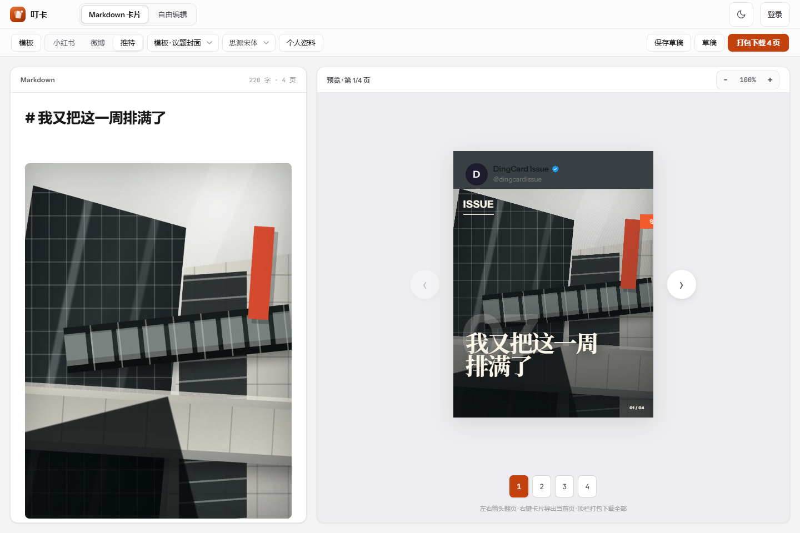
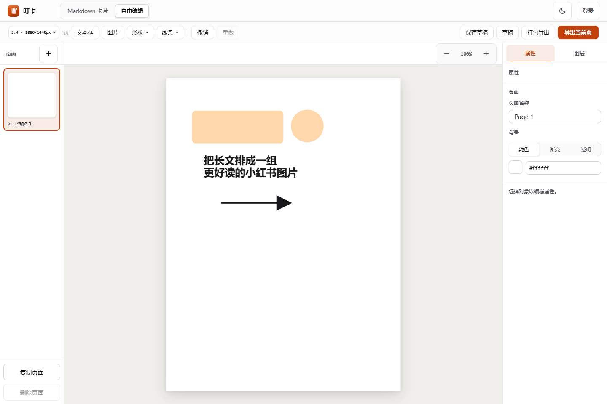
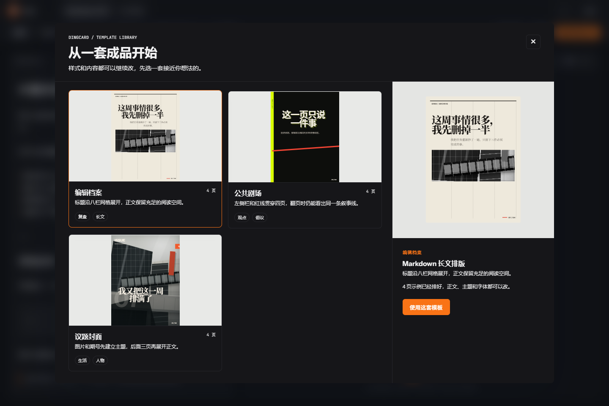
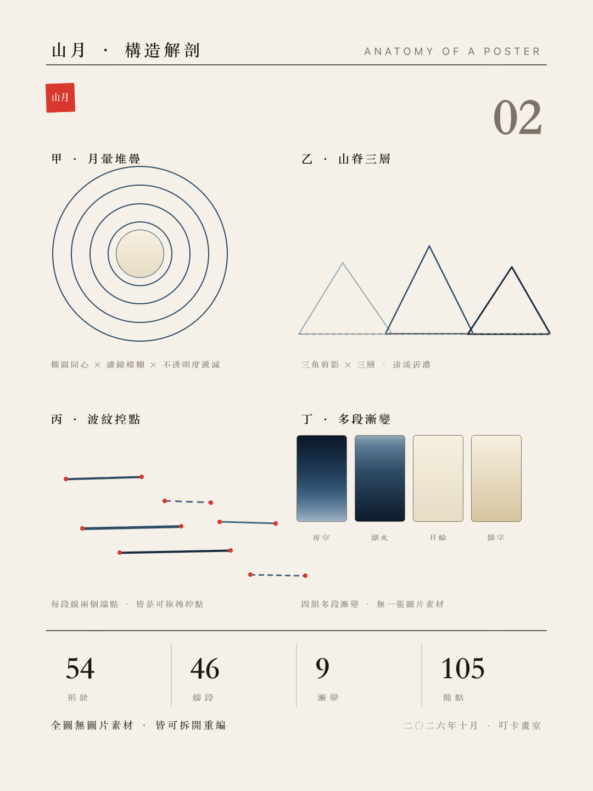

<div align="center">
  <h1> 叮卡</h1>
  <p><strong>小红书长文排版 + 轻设计出图</strong></p>
  <p>把一篇长文整理成适合滑动阅读的图文卡片，也能在自由画布里完成封面和重点页。</p>
  <p>
    <a href="CHANGELOG.md"></a>
    <a href="https://github.com/lottshin/DingCard/actions/workflows/ci.yml"></a>
    <a href="https://dingcard.vercel.app"></a>
    <a href="https://github.com/lottshin/DingCard/pkgs/container/dingcard"></a>
    <a href="docs/deployment.md"></a>
  </p>
  <p>
    <a href="https://vercel.com/new/clone?repository-url=https%3A%2F%2Fgithub.com%2Flottshin%2FDingCard">
      
    </a>
  </p>
  <p><sub>在线版和 Vercel 一键部署使用浏览器本地存储，请及时导出重要作品。</sub></p>
</div>

<p align="center">
  
  
</p>

<p align="center"><sub>左：推特长文自动分页　右：自由画布编辑封面</sub></p>

## 为什么做叮卡

小红书已经提供长文模板，也有不少长文取得了不错的阅读和互动数据。不过，现有模板可调整的内容比较有限，分页方式和字体样式不容易随文章内容调整，图文布局也很难进一步细化。叮卡最初就是为了解决这个问题，让长文排版和配图设计有更多调整空间。

<p align="center">
  
  
</p>

<p align="center"><sub>小红书长文内容示例，账号信息已做模糊处理</sub></p>

叮卡把内容排版和轻量设计放在同一个浏览器工具中：

- 写长文时，用 Markdown 专注内容，实时预览分页效果。
- 做封面或重点页时，切到自由画布，在页面上安排内容并管理图层。
- 完成后导出当前页，或把整组图片打包为 ZIP。
- 默认数据保存在本地浏览器；需要跨设备同步时，可以连接仓库自带的 Fastify + SQLite 服务。

## 两种创作方式

### Markdown 长文排版

把 Markdown 粘到左侧，右侧会同步生成分页预览，适合整理教程、清单和知识分享。

- 发布时可以在小红书、微博和推特的预设尺寸之间切换。
- 选定主题后，仍然可以调整字体、圆角以及个人资料的显示方式。
- 正文中的 `---` 会被当作分页标记，方便你在需要的位置开始下一张卡片。
- 图片粘贴后可以在预览区域调整宽度，不必重新处理原图。
- 当前页面可以单独导出，全部分页也可以一次打包下载。


### 自由画布轻设计

需要自己安排版面时，可以切到自由画布，在同一个作品里完成封面和多页内容。

- 画布里可以加入文字、图片、基础图形和图标（可搜索的线性图标库，矢量图形可改填充和描边），并直接拖动它们的位置和大小；文字可以选中一段局部加粗、标色、高亮或加下划线（富文本片段），也可以一键套用霓虹、描边、立体、标签底色等 16 种花字；页面背景可以是纯色、渐变或图片；「风格」一键给整套卡片换搭配、配色或字体组合，改颜色、改字体时点「全部替换」就能把整套里的同一个颜色、同一个字体一起换掉；自己的字体文件（TTF / OTF / WOFF / WOFF2）可以在字体下拉框里导入，画布和导出都按它画，素材库里统一管理。
- 服务端部署并登录后，图片抽屉里的「在线图库」可以直接搜索并插入可商用的在线图片：Pixabay / Unsplash / Pexels 走服务端代理（密钥只配在服务端 `.env`，见部署文档），没配密钥时自动降级到无需密钥的 Openverse（只搜 CC0 / 公有领域授权）；导入的图片和直接上传一样落进自己的图片库。本地离线模式显示配置提示。
- 独立图片进入“裁剪”后，可以在原画框里移动图片、拖动八个黑柄，并用“比例”菜单快速调整画框；外观面板可以给图片加圆角（一键预设：直角、小圆、大圆、胶囊），「相框」一行加白边或彩色描边，滤镜预设和滑杆也直接给照片上色，导出和样式复制粘贴都带上它们。
- 矩形、圆形和三角形的图片填充仍使用“调整取景”，只改变图片在形状里的位置和缩放。
- 「元素」面板插入图表：柱状（并排/堆叠/百分比）、环形、折线、雷达（维度蛛网，一系一多边形），1–3 个系列带图例和 Y 轴刻度，图例与轴刻度都能在检视器里一键开关（轴刻度关掉后图形占满整个宽度）；数据可以逐行编辑，也可以把表格里的一块整列复制进来粘贴（每行「标签 数值…」，制表符、逗号或空格分隔），一次粘贴一条历史记录，长类目自动折行。
- 图层面板可以修改名称和顺序；相关对象也可以编成一组。
- 暂时不需要的对象可以隐藏，正在调整的对象可以锁定，避免误操作。
- 多页作品可以分别设置尺寸，页面之间也可以复制和调整。
- 导出 PNG、JPG 或 PDF：可以只导出当前页，也可以把全部页面打包成 ZIP、合成一个 PDF，或从上到下拼成一张长图。
- 部署了服务端并登录后，还可以把整套作品「分享链接」：生成一个不用登录就能打开的网页，手机扫码直接看卡片、长按存图进相册；生成前可自选有效期（1 小时到一个月之间按小时定，默认 1 天），链接随时可撤销。Markdown 工作台也有同样的分享入口。


## 模板中心

Markdown 目前有“编辑档案”“公共剧场”“议题封面”三套四页模板，自由画布有八套三页作品，外加二十九套单页模板（小红书封面、菜单、价目表、证书、课程表、朋友圈九宫格、竖版海报、方图、横版封面、公众号首图、A4 宣传单、联系卡、数据盘点、对比表、关注引导、趋势对比、拍立得墙、好物安利、黑白旅拍、能力雷达、时间分配、生日贺卡和成长记录），模板中心可以按名称、说明或标签搜索，也可以按尺寸筛选。「元素」面板里有 48 个手绘线条、贴纸和标签，点一下或拖到画布上就能用。选中后会带着完整内容进入编辑器，可以继续改字、换图和调整样式；在编辑器的模板面板里，模板也能一页一页加进正在做的作品，不同页用不同模板。

模板由社区共建，全部在仓库里维护：做了一套好看的版式，可以按 [贡献模板](docs/templates.md) 提交 Pull Request，合并后所有人都能用。想复用自己的作品，在「我的项目」里把它复制一份再改即可。



## MCP 自动化

`mcp/` 内置一个 stdio MCP 服务器 `dingcard-mcp`，让 AI 客户端和其他程序不必走浏览器 UI，直接完成"选模板 → 生成整套卡片 → 检查 → 无头渲染 → 交给编辑器"的闭环；工具之间传 `documentId`，图片可以直接写本机路径。文档校验与编辑使用和编辑器完全相同的校验器与动作归约器，渲染复用编辑器导出管线（网页字体按字符子集嵌入、图片就绪等待、逐页导出）。

```bash
npm --prefix mcp ci
npm run mcp   # 以 stdio 启动 dingcard-mcp
```

可用工具包括 `list_templates`（含每套模板的尺寸、是整套还是单页、能放多少内容）、`create_document_from_template`、`create_document_from_content` 与 `create_document_from_outline`（按结构化内容或 Markdown 大纲一次生成整套卡片，模板示例文字全部换成内容）、`create_poster_from_content`（按标题、信息行、按钮、主图等生成一张海报，也能生成菜单、价目表、证书和课程表，或加成已有文档的一页）、`add_template_pages`（把任意模板的某几页加进已有文档，不同页用不同模板）、`create_document_from_html`（模板排不出来的版式直接写成 HTML/CSS 网页，转成能逐个修改的设计）、`check_document`（按导出的样子排版后列出文字被裁、叠住、对比度低、残留示例文字等问题，可自动缩字号）、`list_icons`（查内置图标，返回可直接插入的图形节点）、`list_decorations` 与 `add_decorations`（手绘线条、贴纸、标签等装饰素材，一次放好几个）、`list_styles`（可一键套用的配色和字体组合，配合 `apply_actions` 的 `document/restyle` 给整套卡片换风格）、`list_text_styles`（现成的花字，直接作为文字的样式补丁）、`validate_document`、`inspect_document`、`apply_actions`、`render_document`（自由画布无头渲染为逐页 PNG / JPG、一个 PDF、一张长图或九宫格切图，附每页缩略图给模型看）、`open_in_editor`（在叮卡编辑器里打开文档，人接着改）、`get_document`和 `render_markdown`（Markdown 长文无头渲染为一整套卡片 PNG：DOM 实测分页、平台预设、主题与资料头部）。客户端接入配置、`DINGCARD_DIST_DIR` 等环境变量、浏览器要求与安全边界见 [MCP 自动化接口](docs/mcp.md)。

AI 生成的文档也可以一键回到编辑器精修：在工作台「我的项目」点击「导入 JSON」或直接把 `.json` 文件拖进页面，文档会存为项目并在对应的编辑器里打开（自由画布旧版本自动迁移，Markdown 文档同样支持），形成「AI 生成 → 人工精修 → 导出」的完整闭环。

### MCP 作品示例：山月 · 藍染海報

下面这幅蓝染木刻风海报就是用上面的闭环画出来的：文档全部由形状、线段和多段渐变拼成（105 个节点 = 54 个形状 + 46 条线段 + 文字，9 组多段渐变，**零图片素材**），经 `validate_document` 校验后由 `render_document` 无头渲染成图。右页是它的「构造解剖」——月晕是同心椭圆加模糊与透明度递减，山脊是远淡近浓的三层三角剪影，波纹是一条条两端可拖拽的线段（红点即控点）。

<p align="center">
  
  
</p>

<p align="center"><sub>左：山月 · 藍染海報　右：构造解剖页（形狀 54 / 線段 46 / 漸變 9 / 節點 105）</sub></p>

整份两页文档在 [docs/assets/yamatsuki-poster.json](docs/assets/yamatsuki-poster.json)（约 74KB），下载后拖进「我的项目」页面即可在编辑器里打开，每个元素都可以拆开重编。

## 使用与部署

### 在线使用

只想看看效果，可以直接打开[在线 Demo](https://dingcard.vercel.app)。想要一份自己的在线地址，点击上方的 Vercel 按钮即可。Vercel 部署不需要环境变量，草稿仍然保存在访问者当前使用的浏览器中。

### Docker 部署

预构建镜像支持 `linux/amd64` 和 `linux/arm64`：

```bash
docker pull ghcr.io/lottshin/dingcard:0.49.0
```

需要真实账号、跨设备草稿和服务端图片时，可以用 Compose 部署完整应用。`.env.example` 中的 `DINGCARD_VERSION=0.49.0` 会固定使用上面的镜像。下面的流程适用于已经安装 Git、Docker Engine、Docker Compose 和 OpenSSL 的 Linux 服务器：

```bash
git clone https://github.com/lottshin/DingCard.git
cd DingCard

cp .env.example .env
JWT_SECRET="$(openssl rand -hex 32)"
sed -i "s/^JWT_SECRET=.*/JWT_SECRET=${JWT_SECRET}/" .env
unset JWT_SECRET

docker compose pull
docker compose up -d --no-build
curl -f http://127.0.0.1:8080/api/health
```

健康检查返回 `{"ok":true}` 后，通过 `http://服务器地址:8080` 打开叮卡。域名、HTTPS、备份、升级和源码构建见[部署指南](docs/deployment.md)。

## 本地开发

本地开发需要 Git、Node.js 22+ 和 npm，不需要后端：

```bash
git clone https://github.com/lottshin/DingCard.git
cd DingCard
npm ci
npm run dev
```

打开终端输出的地址即可使用。构建并预览生产版本：

```bash
npm run build
npm run preview
```

运行 Playwright E2E 和 MCP 无头渲染时还需要 Chrome；全栈联调和 Docker 部署才需要 Docker Compose。

## 数据模式

### 本地模式

本地模式是默认配置。账号和草稿保存在 `localStorage`，草稿里的大图存在 IndexedDB（`dingcard.pictures`），草稿只记引用；编辑中刚插入的图片也暂存在 `sessionStorage`。

- 不需要服务器，克隆后即可运行。
- 数据只存在当前浏览器，清理浏览器数据会删除本地内容。
- 本地账号仅用于浏览器内区分草稿，不是真实远程身份认证，请勿复用重要密码。
- 重要作品应及时导出。

### 服务器模式

服务器模式使用 `RemoteStore`，提供真实账号、SQLite 草稿和服务端图片存储。设置 `VITE_API_BASE` 后启用。

`LocalStore` 与 `RemoteStore` 是独立数据源，切换模式**不会迁移**已有账号、草稿或图片，也不会覆盖另一端的数据。

<details>
<summary><strong>展开服务器模式开发说明</strong></summary>

先安装后端依赖：

```bash
npm --prefix server ci
```

开发环境可不设置 `JWT_SECRET`，但服务每次重启会生成新密钥并使旧令牌失效；建议本地联调也显式设置。

#### PowerShell

终端一：

```powershell
$env:JWT_SECRET='replace-with-a-local-random-secret'
$env:CORS_ORIGINS='http://127.0.0.1:5173'
npm --prefix server run dev
```

终端二：

```powershell
$env:VITE_API_BASE='http://127.0.0.1:3000'
npm run dev -- --host 127.0.0.1 --port 5173 --strictPort
```

后端不会自动读取 `server/.env`；直跑时请像上面一样在进程环境中设置变量。完整变量说明见 `server/.env.example`。

#### POSIX Shell

终端一：

```bash
export JWT_SECRET='replace-with-a-local-random-secret'
export CORS_ORIGINS='http://127.0.0.1:5173'
npm --prefix server run dev
```

终端二：

```bash
export VITE_API_BASE='http://127.0.0.1:3000'
npm run dev -- --host 127.0.0.1 --port 5173 --strictPort
```

后端健康检查地址为 `http://127.0.0.1:3000/api/health`。

</details>

## 开发与验证

| 命令 | 用途 |
|---|---|
| `npm run dev` | 启动 Vite 开发服务器。 |
| `npm run build` | 运行 TypeScript 检查并生成生产构建。 |
| `npm run preview` | 本地预览生产构建。 |
| `npm test` | 依次运行前端单元、后端、MCP 和完整 E2E。 |
| `npm run test:unit` | 运行前端 Vitest。 |
| `npm run test:unit:watch` | 以监听模式运行前端单元测试。 |
| `npm run test:server` | 运行后端 Node 测试。 |
| `node server/smoke-test.mjs` | 启动临时真实后端并验证 HTTP 契约。 |
| `npm run test:mcp` | 运行 MCP 包单元测试（模板、文档校验、动作归约、静态服务器、协议层）。 |
| `npm run test:mcp:render` | 运行 MCP 真实浏览器渲染管线测试（模板文档 → PNG）。 |
| `npm run mcp` | 以 stdio 启动 dingcard-mcp 服务器，供 MCP 客户端接入。 |
| `npm run test:e2e` | 运行 LocalStore E2E 与编辑器验收。 |
| `npm run test:e2e:headed` | 在可见浏览器中运行 E2E。 |
| `npm run test:acceptance` | 仅运行编辑器关键验收旅程。 |
| `npm run test:integration` | 运行真实 Fastify + RemoteStore 集成套件。 |
| `node --test scripts/release-readiness.test.mjs` | 检查发布文档、CI 和验证记录契约。 |

后端自身还提供 `npm --prefix server start`、`npm --prefix server run dev` 和 `npm --prefix server test`。

## 数据与部署边界

- 直跑后端默认把 SQLite 和上传文件写入 `server/data/`；可用 `DATA_DIR` 覆盖。
- Compose 使用独立的数据库卷和上传卷，升级镜像不会自动删除数据。
- 备份必须同时包含 SQLite 数据库与 `uploads` 目录。
- 正式环境必须在可信反向代理处终结 HTTPS，并限制数据库和上传目录权限。
- 当前不提供 LocalStore 到 RemoteStore 的自动导入流程。

## 技术栈

- React 18、TypeScript、Vite
- CodeMirror 6、Marked
- Fastify、SQLite、JWT、bcrypt
- Vitest、Playwright
- Docker Compose

## 文档

- [自由画布数据模型与交互说明](docs/freeform-editor.md)
- [贡献模板](docs/templates.md)
- [MCP 自动化接口](docs/mcp.md)
- [Docker 部署与维护](docs/deployment.md)
- [后端实现与接入方案](docs/backend-plan.md)
- [0.19.0 发布验证](docs/release-verification.md)
- [更新日志](CHANGELOG.md)
